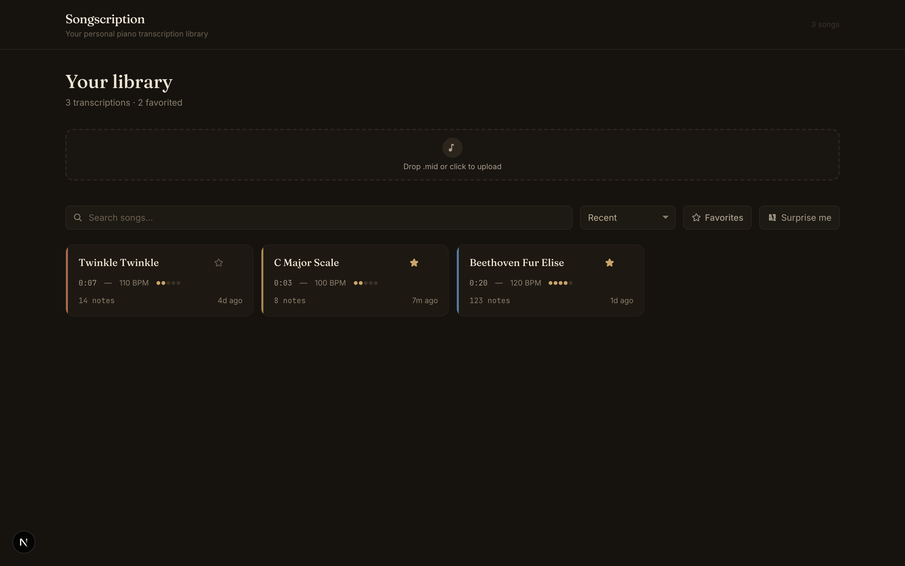

# Songscription — Catalogue

A catalogue page for a piano-learning app. Upload a `.mid` file (the stand-in for "you just transcribed a song"), it joins your library, and you click in to a learner-focused detail view with a real piano-roll you can play back in the browser.

Built for the Songscription full-stack take-home. Live demo + repo links are in the submission email.



## What it does

- **Upload** `.mid` files via drag-and-drop or click. The file is parsed server-side, the blob goes to Supabase Storage, and the metadata lands in Postgres. Optimistic UI on the catalogue.
- **Browse** every transcription as a grid of cards. Each card shows the real parsed musical facts (key, tempo, duration, difficulty, note count) and a per-song accent color derived from the file's fingerprint, so songs are easy to tell apart.
- **Discover** with search, sort (recent / A–Z / difficulty / duration / recently played), a favorites filter, and a "Surprise me" shuffle for the days you don't know what to practice.
- **Click in** to a detail view: a canvas **piano-roll of the actual notes**, in-browser **playback** (Tone.js) with a moving playhead, the full metadata a learner cares about, and a placeholder panel for the real practice/piano-roll experience.

It persists. Refresh and everything is still there, because it's all in Supabase.

## Backend: Supabase (Postgres + Storage)

I went with Supabase because it's what Songscription uses, and it's the right tool here: a relational table for the queryable metadata plus object storage for the raw `.mid` blobs, in one service.

### Data model — `transcriptions`

Every song is one row. The interesting design choice is **what to store**: I parse the MIDI once on upload and persist the summary facts a learner actually scans (tempo, key, time signature, duration, note count, pitch range, track count), plus a derived `difficulty` (1–5) and a derived `color` accent. The raw note events are NOT stored in the row — they'd bloat it and they're only needed on the detail view, so I re-parse the blob client-side there. That keeps list queries tiny and fast.

| Column | Type | Notes |
|---|---|---|
| `id` | uuid | pk |
| `title` | text | from filename or user override |
| `created_at` | timestamptz | |
| `file_path` | text | key in the `midi` storage bucket |
| `file_size` | int | bytes |
| `duration_sec` | real | parsed |
| `tempo_bpm` | int \| null | many MIDIs declare none |
| `key_sig` | text \| null | e.g. "C major" |
| `time_sig` | text \| null | e.g. "4/4" |
| `track_count` | int | tracks with notes |
| `note_count` | int | |
| `lowest_note` / `highest_note` | int \| null | MIDI note numbers → shown as "E2 – F5" |
| `difficulty` | int (1–5) | derived from note density + range + polyphony |
| `color` | text | derived accent, stable per file |
| `is_favorite` | bool | |
| `last_played_at` | timestamptz \| null | bumped on playback |
| `play_count` | int | bumped on playback |

Indexed on `created_at`, `is_favorite` (partial), `last_played_at`, and `lower(title)` so the sorts and search stay cheap as the library grows.

The migration is in [`supabase/migrations/0001_init.sql`](supabase/migrations/0001_init.sql). Writes go through the service-role key server-side; the public client gets read-only access via RLS (there's no auth in this app by design).

### Storage boundary

Nothing in the UI touches Supabase directly. Everything reads/writes through [`src/lib/storage.ts`](src/lib/storage.ts), so the backend is swappable and the data access is in one place.

## Stack

Next.js 15 (App Router) · TypeScript · Tailwind · Supabase · `@tonejs/midi` (parsing) · `tone` (playback) · Fraunces / Inter / JetBrains Mono.

## Running it locally

```bash
npm install

# .env.local
NEXT_PUBLIC_SUPABASE_URL=...
NEXT_PUBLIC_SUPABASE_PUBLISHABLE_KEY=...
SUPABASE_SERVICE_ROLE_KEY=...

# apply the schema to your Supabase project
supabase link --project-ref <your-ref>
supabase db push

# seed the 3 sample songs with mock practice data (optional)
npm run seed

npm run dev   # http://localhost:3000
```

## Project layout

```
src/
  app/
    page.tsx                  catalogue (server-fetched initial list)
    song/[id]/page.tsx        detail view
    api/transcriptions/       REST route handlers (list, upload, get, patch, delete, play)
  components/
    catalogue/                grid, card, discovery bar
    detail/                   piano-roll (canvas), playback (Tone.js), metadata, practice placeholder
    upload/                   drag-and-drop dropzone
  lib/
    midi.ts                   MIDI parsing + difficulty/color derivation
    storage.ts               the Supabase boundary
    types.ts                  shared types
    format.ts                duration / relative-time / note-name helpers
  utils/supabase/            clients (browser publishable, server service-role)
supabase/migrations/         schema
scripts/seed.mjs             sample data seeder
```
